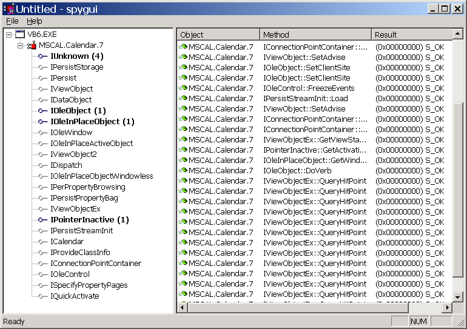

# COM Spy


COM Spy (originally the "control spy") is a 1999 utility for spying on COM objects. It grew out of the DebugHook/CoDelegator tracing work by Chris Sells and Keith Brown.

This repo holds the source, recovered via the Wayback Machine from `comspy_src.zip` (January 2000), along with the original v0.1 release and its home page. The write-up below is that page, from staff.develop.com/jasonw/comspy.

## Repo layout

- `src/`: the Visual C++ 6 source
  - `ctlspysrv/`: ctlspysrv.dll, the core: the blind delegator and the hooking
  - `debugger/`: agent.exe, the taskbar helper process
  - `hookcfg/`: spycfg.exe, which hooks and unhooks classes
  - `spygui/`: comspy.exe, the MFC GUI
- `archive/`: the original web pages, the v0.1 binary release (`comspy01.zip`), the source zip, and images

Per the original source notes, this code is close to, but not exactly, what built the released binaries. Some of the MTA-spying work had already been started in it.

### Building (from the original source notes)

Build each project, then `nmake ctlspysrv\ctlspysrvps.mk` and `debugger\debuggerps.mk` to build the proxy/stub DLLs, then register everything (`install.bat`).

---

# The COM spy

Welcome to the COM Spy home page.

Last Updated **8/05/99**

## What is it?

The COM spy is a free utility for spying on COM objects. With the current version you can:

- See what interfaces are being held on an object
- Watch them change in real time
- See all method calls made to an object along with their HRESULTs.
- See what interfaces/objects are leaked by containers
- Do this with **any** ActiveX control in **any** container.



This version represents the bare minimum of features that I thought were acceptable for people to play with. There are many more obvious features that will be added over time, but even in it's limited state this can be a pretty useful tool.

## Download!

You can download the zip file [here](archive/comspy01.zip). Read on to learn how to set up and use the spy. (It's quite trivial).

## Quick Demo

- Once you've extracted the zip file you'll find an assortment of DLLs, a batch file, and three executables. First things first; run **install.bat** This will register the appropriate dlls and exes.

- To spy on a com object you'll have to hook it with the **spycfg** program. This program simply displays a listview containing all of the ProgIds in the system. Choose a class you would like to spy on and click the checkbox to associate the spy with it.

   **!Note:** If you hook a class and then rebuild/reregister the control you will need to run spycfg and re-hook the class (a la **mtxrereg**).

   **!Note: Currently the spy will only work with objects marked "ThreadingModel=Apartment". The configurator, however, displays all clsids**, so exercise caution here.

- Next, open **COMSpy.exe**. You'll notice a task bar icon appear; this is a system agent that assists the COM spy; it should come and go on its own as you use the spy. (You may have to manually close it sometimes; just make sure that no hooked controls are active and that COMSPY.EXE is not running).

- Once you've done that open up VB or the ActiveX Control Test Container, and create an instance of your control. Your object will appear in the COM spy. The rest is self explanatory....

## Bugs and limitations

I'm far from claiming that the COM spy is bug free. The current version of the "agent" process is a bit unstable and doesn't always shut down correctly (and sometimes dies a nasty death). As bug reports come my way I'll try to post them here. You can send them to me at jasonw@develop.com.

####  COMSPY will only work with programs that have a message loop.

In order for COMSPY to be able to get notifications from hosted objects the hosting app must have a message loop. This is a silly limitation and should go away at some point.

####  COMSPY will only detect leaks for objects that have been expanded in the tree view at least once.

This is a tradeoff - it's pretty expensive to determine what interfaces an object supports. So COMSPY only does it when you expand an object for the first time. The only way it know if interfaces were leaked, however, is if it acquires this information prior to the process shutting down.

####  COMSPY currently only works for inproc (DLL, OCX) servers

This may be changed in the future

####  COMSPY has not been tested with MTS

I don't have any Nt4 boxes right now. So far the people who've tried it haven't had much luck. I did get this email however (from John DeAngelis) who had some luck. He writes:

> I removed the MTS Bank components from the package - this had the effect of unregistering the components.
>
> I then registered the components manually by doing regsvr32 vbacct.dll. OleView confirms that there's only an InprocServer32 key pointing to the dll. Threading model = Apartment.
>
> Next I hooked the 5 components supported by that dll through spycfg. OleView now shows each component as having:
>
> ```
> InprocServer32[<noname>] = D:\work\com\comspy\CTLSPY~1.DLL
> InprocServer32[ThreadingModel] = Apartment
> InprocServer32[HookSavedPath] = c:\program files\mts\samples\packages\vbacct.dll
> ```
>
> Finally, I added the dll to the SampleBank MTS package. Now if I add the components by selecting those that are already registered I end up with the following registry keys for the components:
>
> ```
> InprocServer32[<noname>] =
> InprocServer32[ThreadingModel] = Free
> InprocServer32[HookSavedPath] = c:\program files\mts\samples\packages\vbacct.dll
> LocalServer32 = c:\winnt\system32\mtx.exe /p:{package-guid}
> ```
>
> and the MTS Explorer shows the component dll as D:\work\com\comspy\CTLSPY~1.DLL. Running the client against this setup makes COMSPY work!!
>
> If I add the component to MTS by adding the file I end up with the same registry keys for the component but the MTS explorer shows the component dll as c:\program files\mts\samples\packages\vbacct.dll. Running the client against this setup shows nothing in the comspy gui (the client no longer fails ?!!!).
>
> I repeated the above scenarios and I (now) get these results consistently. So we have a workable solution - you just have to be careful how you add those components into MTS!

####  The AGENT process shuts down after 5 seconds

This is expected behavior - you shouldn't start AGENT manually.

####  The AGENT process doesn't always go away correctly (And sometimes dies)

This is usually benign - you can close it manually. Of course this bug will have to be fixed.

####  When I run the spy I get "The ordinal 6785 could not be located in MFC42.DLL"

I built the spy with VS6 sp0. Apparently this has caused some problems. I will update my compiler ASAP; that appears to be the problem.

####  Marshal-by-value doesn't work

Currently the COM spy will reject any requests for IMarshal with E_NOINTERFACE.
